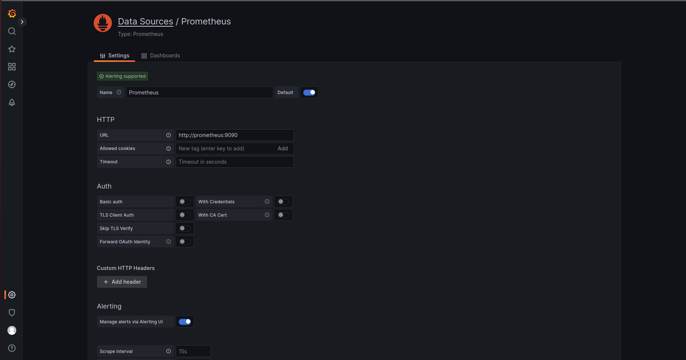
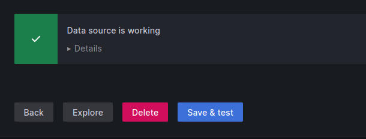
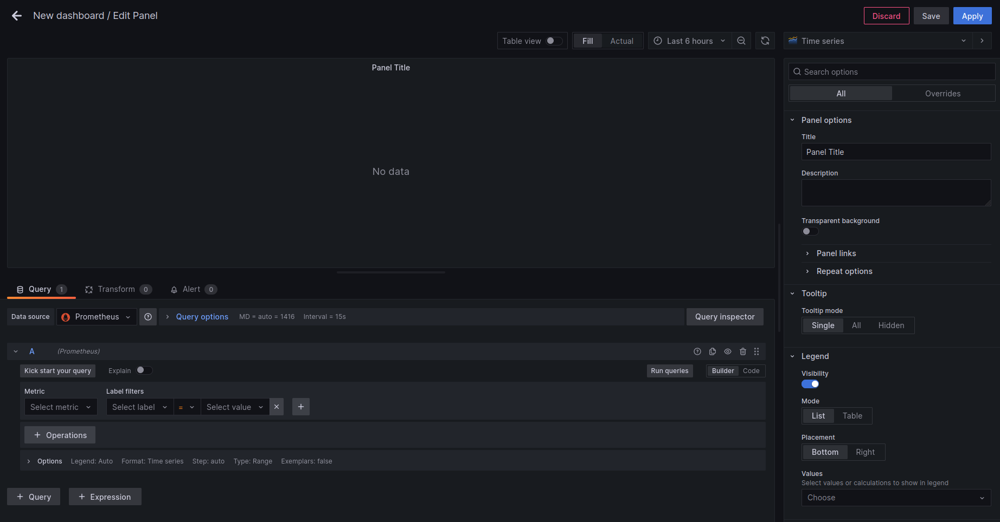
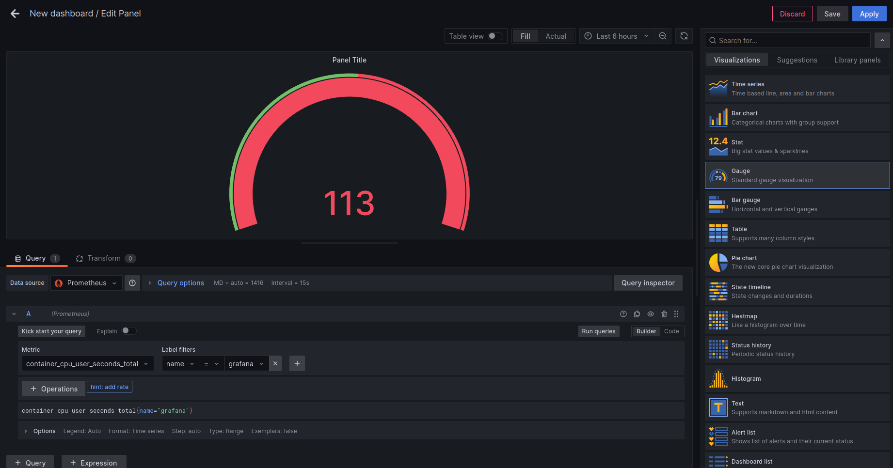
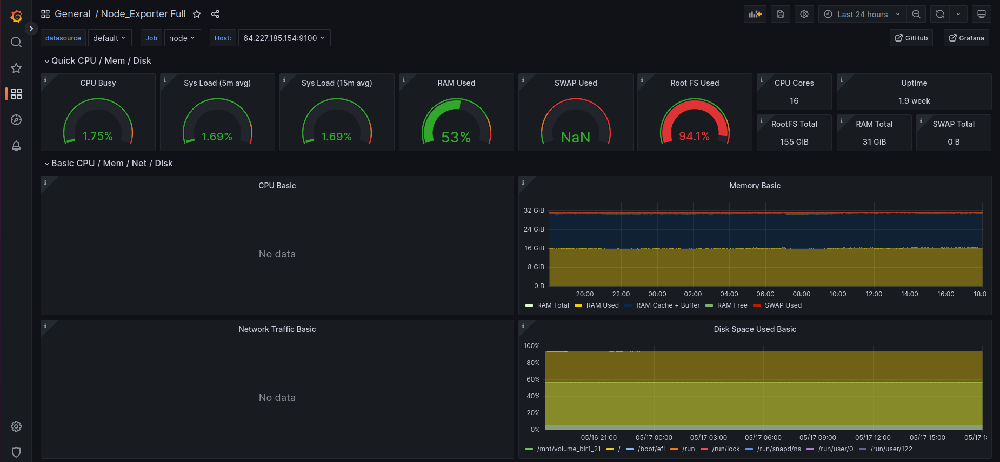

# Grafana Installation and Dashboard Setup 

`Step 1` :
	Refere following docker-compose.yml file for grafana that includes prometheus, cadvisor and node-exporter. But in following docker-compose file we have changed the default ports of the services you can choose it as default 

```
version: '3'

volumes:
  grafana-data:
    driver: local
  prometheus-data:
    driver: local

services:
#Prometheus 


   prometheus:
    image: prom/prometheus:latest
    container_name: prometheus
    ports:
      - "9090:9090"
    volumes:
      - /etc/prometheus/config:/etc/prometheus
      - prometheus-data:/prometheus
    restart: unless-stopped

#Grafana


   grafana:
    image: grafana/grafana-oss:latest
    container_name: grafana
    ports:
      - "3005:3000"
    volumes:
      - grafana-data:/var/lib/grafana
    environment:
     -  GF_SERVER_ROOT_URL=https://ulp.uniteframework.io/grafana
    restart: unless-stopped

#Node_exporter


   node_exporter:
    image: quay.io/prometheus/node-exporter:latest
    container_name: node_exporter
    command:
      - '--path.rootfs=/host'
    network_mode: host
    pid: host
    restart: unless-stopped
    volumes:
      - /:/host:ro,rslave

   cadvisor:
    image: google/cadvisor
    container_name: cadvisor
    volumes:
      - /:/rootfs:ro
      - /var/run:/var/run:rw
      - /sys:/sys:ro
      - /var/lib/docker/:/var/lib/docker:ro
   
    ports:
      - "8005:8080"
```


 
`Step 2` :
	Create a prometheus.yml file in the following directory with the following configurations in that if any directory not present at location create it. And put your IP in the yml file.
		`/etc/prometheus/config/prometheus.yml`

```         
global:
  scrape_interval: 5s # By default, scrape targets every 5 seconds.
  evaluation_interval: 1m
  # Attach these labels to any time series or alerts when communicating with
  # external systems (federation, remote storage, Alertmanager).
  # external_labels:
  #  monitor: 'codelab-monitor'

# A scrape configuration containing exactly one endpoint to scrape:
# Here it's Prometheus itself.
scrape_configs:
  # The job name is added as a label `job=<job_name>` to any timeseries scraped from this config.
  - job_name: 'prometheus'
    # Override the global default and scrape targets from this job every 5 seconds.
    scrape_interval: 6s
    static_configs:
      - targets: ['localhost:9090']

  - job_name: docker_metrics
    static_configs:
      - targets: ['<IP>:9323']

  - job_name: 'cadvisor'
    scrape_interval: 90s
    scrape_timeout: 30s
    tls_config:
      insecure_skip_verify: true
    static_configs:
      - targets: ['<IP>:8005']

  - job_name: node
    scrape_interval: 90s
    scrape_timeout: 30s
    tls_config:
      insecure_skip_verify: true
    static_configs:
      - targets: ['<IP>:9100']
```

`Step 3` : 
	Go the specific directory where your `docker-compose.yml` is present and perform following command 
```			
docker-compose up -d 
```

`Step 4` : 
 	Go to browser and search http://ip:9090 and you will get a prometheus dashboard like following  and goto —> status —-> targets


`Step 5` :
	Wait till all the services are not up and running like following 


`Step 6` :
	Go to browser and search for the grafana http://ip:3006 and you will get Grafana login page use User as admin and password as admin for login 
After that go to configure —> Datasource —> Add new Datasource —> Prometheus 
After selecting prometheus as a datasource you will get following page add URL filled as mentioned in the following image



`Step 7` : After adding Save and test the datasource you will get response as 




`Step 8` :
	Go to the home of grafana and go to Dashboards —> New Dashboards —> Add new Panel and you will get following page 

  
  

`Step 9` : Select the following in the fields 


	Datasource : Prometheus 
	Metric : container_cpu_usage_seconds_total
	label : name


add your container and run the query (here i have used grafana). Select virtualization as Gauge and you will get following output  

 

Save the Dashboard in the upper Right corner and Apply.


`Step 10` :
	You can add Dashboards also which is predefined by the Grafana for that Go to 
Dashboards —> Import —> put Id of the Dashboard —> change ID —> Select Datasource —> import 

I have taken Dashboard id as 1860
You can find more Dashboards here : https://grafana.com/grafana/dashboards/?search=node+exporter
By selecting above Dashboard (1860) you will get an output as 

